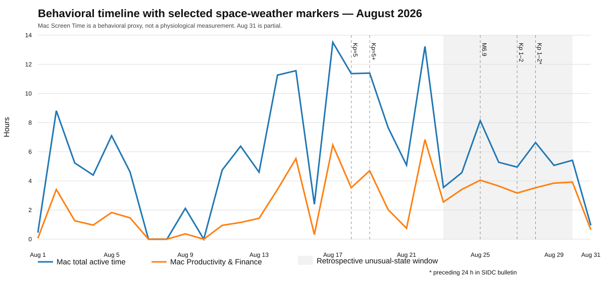

# Before I Knew What to Measure

## Following an Intuition Through Behavioral Data, Space Weather, and the Search for What Actually Changed

**Author:** Amir Ahmadi  
**Year:** 2026  
**Status:** Working paper / evidence-backed personal investigation

This paper examines a simple but difficult question: what is intuition actually good for when it points toward a real external event, but the first controls begin to weaken the causal story?

The investigation began with an unusual week of fatigue, sleepiness, muscular weakness, reduced exercise capacity, and difficulty sustaining deep work. Before checking any space-weather reports, the author formed an unusual hypothesis that something outside the body might have changed and looked toward solar activity.

A real solar/geomagnetic sequence was present in the same broad period. But the behavioral record also contained important counterexamples, including days with geomagnetic activity and relatively strong computer use. The paper therefore treats intuition as a hypothesis generator rather than evidence.

Core thesis:

> **Anomaly Detection ≠ Causal Identification**

and:

> **Maybe intuition is not a way of knowing. Maybe it is a way of noticing where knowing should begin.**

## Repository structure

- `paper.en.md` — English working paper
- `paper.fa.md` — Persian version
- `evidence/` — evidence manifests, provenance and source-archive documentation
- `data/` — extracted behavioral and environmental datasets
- `figures/` — article-ready visualizations
- `methods/` — analysis plan, assumptions, controls, and limitations
- `references/` — source notes and citations

## Figure 1

Figure 1 places the reconstructed Mac behavioral record on one timeline with a deliberately small set of selected space-weather markers. The shaded interval is the retrospectively reported unusual-state window. The figure is descriptive, not causal: Screen Time is a behavioral proxy, and the environmental markers are not evidence of biological effect.

A key counterexample is visible around August 18–19: observed Kp≈5 / Kp≈5+ intervals occurred while Mac activity remained comparatively high. This weakens a simple model in which geomagnetic activity alone is sufficient to produce the later behavioral state.

## Methodological position

This is not presented as evidence that space weather caused the reported symptoms. The current evidence supports a behavioral state change and confirms that measurable space-weather events occurred in the same broad period, but a direct causal relationship has not been established.

The project is explicitly designed to preserve counterevidence and to make the initial hypothesis easy to falsify.

## Evidence policy

Original screenshots are treated as source records rather than illustrations. Numerical values used in analysis must remain traceable from source capture → manifest → extracted dataset → figure. A SHA-256 manifest (`evidence/raw-evidence-manifest.csv`) records the canonical filename, original capture filename, byte size and digest for 40 reviewed source images.

The source set was visually reviewed for unrelated sensitive identifiers. The Mac captures did not show unrelated personal identifiers; the iPhone captures display the account label `@@` but no unrelated private message, contact, financial-account number or notification content was observed in the reviewed set.

## Current status

Completed so far:

- English and Persian working-paper drafts
- Mac daily Screen Time dataset for August 1–31
- selected iPhone Screen Time dataset
- initial observed/forecast-separated space-weather event table
- evidence mapping and SHA-256 source manifest for 40 unique screenshots
- initial falsification/control notes
- Figure 1 behavioral/space-weather timeline

Still pending before a public evidence release:

- commit of the binary screenshot source package into the public repository
- fuller environmental time-series acquisition (Kp, Dst, IMF Bz, solar-wind speed and density)
- fixed-lag analysis using the preregistered 0/6/12/24-hour windows
- prospective blinded follow-up

The binary screenshot package is intentionally treated as a separate release step so the paper does not imply that a hash manifest alone is equivalent to publicly available raw evidence.
