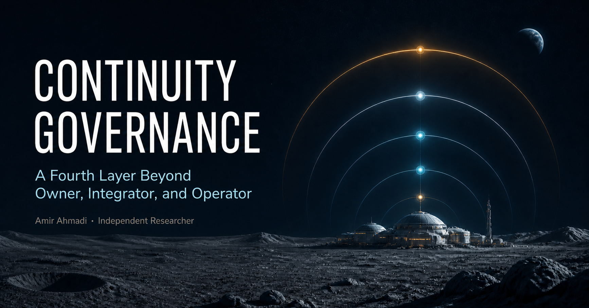

# Continuity Governance for Long-Duration Critical Infrastructure
## A Fourth Layer Beyond Owner, Integrator, and Operator

**Author:** Amir Ahmadi  
**Affiliation:** Independent Researcher  
**ORCID:** 0009-0000-0614-6869  
**Document ID:** ARP-CG-2026-01  
**Version:** 0.1.0 — Public Working Paper

\newpage

## Abstract

Long-duration critical infrastructure—illustrated here by a lunar installation—may outlive its founding company, operating contractor, software stack, and original decision-makers. A familiar division of responsibility assigns roles to an **Owner**, **Integrator**, and **Operator**. This paper argues that the division is incomplete when safe and legitimate operation depends on preserving the reasons, evidence, authority boundaries, and obligations that survive each handover. It proposes a fourth, non-operational layer: **Continuity**.

Continuity governance is defined as the independent, auditable stewardship of the records, access conditions, and transfer rules required for a critical system to remain understandable and accountable through change. The paper introduces epistemic lineage, responsibility lineage, and critical-knowledge access; distinguishes them from ordinary documentation, intellectual-property ownership, and operational control; and proposes “Glass Mind” as a candidate design pattern for inspectable governance intelligence. The framework does not prescribe blockchain, DAOs, NFTs, tokenisation, or AI autonomy. Those are possible mechanisms, not conclusions. The contribution is a bounded conceptual hypothesis with explicit limitations and evaluation questions.

**Keywords:** continuity governance; critical infrastructure; lunar infrastructure; accountability; provenance; knowledge lineage; intellectual property

## 1. The handover problem

An asset can be transferred while the ability to govern it is lost. Technical manuals may remain, yet the assumptions behind a safety threshold, the source of a calibration, the unresolved trade-off in a design review, or the party that accepted a residual risk may disappear. This is especially consequential where repair, resupply, evacuation, or external oversight are slow or unavailable.

The problem is not unique to the Moon. Nuclear stewardship, public utilities, medical infrastructure, archives, and long-lived software all face it. Lunar infrastructure is a useful stress case because it compresses the consequences of institutional amnesia: a local operator may need to act before a distant owner, supplier, or regulator can reconstruct the system’s history.

The conventional model is:

> **Owner → Integrator → Operator**

It usefully separates capital and rights, system assembly, and day-to-day use. It does not, by itself, specify who protects the conditions that make a later transfer intelligible and contestable. This paper therefore asks: **who is accountable for continuity when all three roles change?**

## 2. Scope, method, and provenance

This is a conceptual position paper, not a claim that a Continuity layer has been empirically validated or is legally required. It develops definitions, distinguishes adjacent concepts, and states propositions that can be tested against case studies and simulated handovers.

A public LinkedIn post by Roberto M. prompted the initial question about the Owner–Integrator–Operator model in lunar infrastructure. That public discussion is acknowledged as inspiration, not as a source of authority for the claims below. Roberto M. has not reviewed, endorsed, co-authored, or participated in this paper. The fourth-layer model and its articulation are the independent contribution of this paper.

The framework is intended for infrastructure where failure can create serious safety, environmental, public-interest, or continuity consequences. It does not claim that every ordinary product, business process, or short-lived service needs a separate continuity institution.

## 3. The proposed fourth layer

**Continuity** is not another owner, system integrator, or operator. It is a governance function with a narrower duty:

> **to preserve the minimum inspectable record, access conditions, and handover rules needed to reconstruct authority, evidence, uncertainty, and obligation across material change.**

Its authority should be bounded. It should not routinely direct operations, seize commercial assets, publish protected information, or substitute itself for democratic, contractual, or safety authority. Instead, it should set and audit continuity requirements: what must be preserved; who may see it under which conditions; how a successor verifies it; and how gaps, conflicts, and emergency exceptions are logged.

**Figure 1.** Operational authority can be delegated from owner to integrator to operator. Continuity preserves cross-cutting knowledge and responsibility lineage; it does not become a fourth operational command.

## 4. Four continuity objects

### 4.1 Epistemic lineage

**Epistemic lineage** is the traceable history of what a consequential decision relied on: evidence, models, assumptions, uncertainty, dissent, version, and rationale. It answers not only *what was decided?* but *why was this reasonable at the time, and what was unknown?* It is more demanding than a document archive because it links records to decision context and permits a successor to challenge them.

### 4.2 Responsibility lineage

**Responsibility lineage** records the authority path around consequential action: who had power to decide, who advised, who accepted risk, who executed, and which obligations transferred. It is not blame automation. It creates a reviewable map of delegation and acceptance, including periods in which authority was unclear or contested.

### 4.3 Critical-knowledge access without IP hostage-taking

Commercial intellectual property can retain economic value. The proposal is not compulsory disclosure of all proprietary material. The narrower principle is that a rights holder should not be able to make safety-critical understanding unavailable when withholding it creates a material continuity risk.

Possible safeguards include escrowed technical materials; trusted access under defined triggers; exportable, interoperable records; successor-readiness tests; time-limited confidentiality; and independent verification that required knowledge can be reconstructed. The correct instrument will depend on law, contract, export controls, security, and the system’s risk class. The paper does not claim that one universal access rule is appropriate.

### 4.4 Transfer protocol

At each material handover, a successor should be able to establish: (1) system state and configuration; (2) known hazards and uncertainties; (3) decision and responsibility lineages; (4) the accessible body of critical knowledge; and (5) unresolved obligations. A continuity protocol should also record exceptions and the reason normal transfer conditions could not be met.

## 5. Glass Mind: a bounded candidate mechanism

**Glass Mind** is a proposed design pattern, not a claim about machine consciousness or an autonomous governor. It denotes an auditable governance intelligence—human, software-supported, or hybrid—whose material inputs, authority, conflicts of interest, actions, and reasons for action are inspectable to authorised reviewers.

Its role could be limited to checking handover completeness, detecting missing lineage, maintaining access rules, and producing contestable continuity reports. It should not be trusted merely because it is transparent: records can be incomplete, reasons can be post-hoc, and audit trails can be manipulated. Its legitimacy would depend on independent oversight, defined appeal paths, security controls, and the continuing ability of accountable humans and institutions to overrule it.

Distributed ledgers, DAOs, NFTs, tokenisation, and cryptographic attestations may support particular properties such as tamper evidence, shared control, or traceability. They do not establish truthful input, good judgment, equitable representation, or lawful authority. None is necessary to the framework.

## 6. Claims, limits, and falsification

The paper makes four deliberately limited claims:

1. In long-duration critical systems, preserving assets and manuals alone may be insufficient for accountable handover.
2. Separating epistemic lineage from responsibility lineage makes continuity failures easier to identify and audit.
3. It is conceptually possible to preserve a minimum critical-knowledge path without abolishing IP rights.
4. A non-operational continuity function is a plausible governance design hypothesis worth comparing with owner–integrator–operator arrangements alone.

The framework would be weakened if comparative exercises show that conventional contractual documentation and safety management consistently reconstruct the same decision context, authority, and critical knowledge at lower cost and equal reliability. It would also be weakened if independent continuity bodies predictably obstruct emergency action, create unacceptable security exposure, or cannot maintain legitimacy across jurisdictions.

Key limitations remain. The proposal does not solve conflicts between commercial rights, state authority, planetary protection, labour rights, and public interest. It does not establish who appoints a continuity steward or which legal forum governs a multi-jurisdictional lunar asset. It does not specify retention periods, disclosure thresholds, funding models, or technical standards. These are open design and policy questions, not hidden assumptions.

## 7. Research agenda

The proposal can be tested without waiting for a lunar settlement. Candidate studies include: tabletop handovers using historical industrial incidents; red-team attempts to reconstruct a system after supplier failure; controlled comparison of ordinary documentation against lineage-aware records; and governance simulations that measure time-to-safe-transfer, completeness of hazard reconstruction, dispute resolution, and unauthorised disclosure.

Useful falsifiable questions include:

- Does a continuity record enable independent reviewers to reconstruct why a safety-critical decision was made more accurately than a conventional archive?
- Can escrow and trigger-based access protect commercially meaningful IP while reducing safety-critical knowledge loss?
- Which parts of Glass Mind can be automated without obscuring human responsibility?
- What oversight design prevents continuity from becoming either a ceremonial archive or an unaccountable fourth sovereign?

## 8. Conclusion

Long-lived infrastructure needs more than a chain for building and operating an asset. It needs a defensible way to carry forward the knowledge, authority, uncertainty, and obligation that make future action accountable. **Owner → Integrator → Operator → Continuity** is offered as a disciplined question, not a completed answer: can a system preserve the conditions of responsible succession without concentrating control or holding critical human knowledge hostage? The answer should be established through law, engineering, institutional design, and empirical testing—not rhetoric or technology branding.

## Acknowledgment of inspiration

Roberto M.’s public LinkedIn discussion of owner, integrator, and operator roles in lunar infrastructure prompted the question developed here. This acknowledgement records intellectual inspiration while preserving clear boundaries: this paper is independent, and no endorsement, collaboration, or agreement by Roberto M. is implied.

## References

1. National Aeronautics and Space Administration. (2020). *NASA Systems Engineering Handbook* (NASA/SP-2016-6105 Rev2). https://www.nasa.gov/reference/nasa-systems-engineering-handbook/
2. International Organization for Standardization. (2018). *ISO 55000:2014 Asset management — Overview, principles and terminology*. https://www.iso.org/standard/55088.html
3. United Nations. (1967). *Treaty on Principles Governing the Activities of States in the Exploration and Use of Outer Space*. https://www.unoosa.org/oosa/en/ourwork/spacelaw/treaties/outerspacetreaty.html
