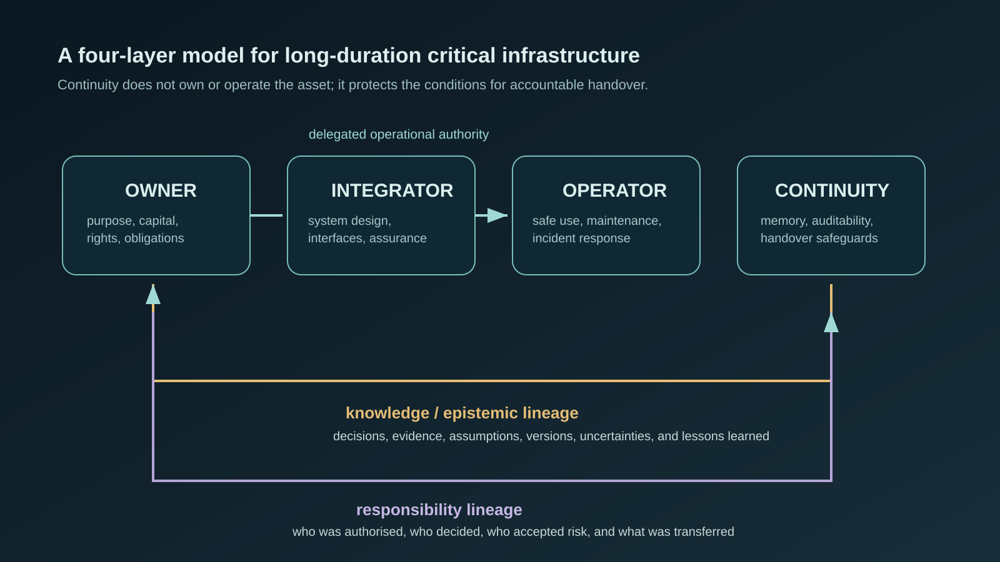

# حکمرانی تداوم برای زیرساخت‌های حیاتی بلندمدت
## لایهٔ چهارم فراتر از مالک، یکپارچه‌ساز و اپراتور

**نویسنده:** امیر احمدی  
**وابستگی:** پژوهشگر مستقل  
**ORCID:** 0009-0000-0614-6869  
**شناسهٔ سند:** ARP-CG-2026-01  
**نسخه:** ۰.۱.۰ — مقالهٔ کاری عمومی

## چکیده

زیرساخت حیاتی بلندمدت—که در اینجا یک تأسیسات ماه را نمونه‌ای فشرده از آن می‌گیریم—ممکن است از شرکت سازنده، پیمانکار بهره‌بردار، پشتهٔ نرم‌افزاری و تصمیم‌گیرندگان اولیهٔ خود بیشتر عمر کند. تقسیم‌بندی رایج مسئولیت میان **مالک**، **یکپارچه‌ساز** و **اپراتور** است. این مقاله استدلال می‌کند که وقتی بهره‌برداری ایمن و مشروع به حفظ دلیل‌ها، شواهد، مرزهای اختیار و تعهدهایی وابسته است که از هر تحویل عبور می‌کنند، این تقسیم‌بندی کافی نیست. ازاین‌رو یک لایهٔ چهارم و غیرعملیاتی پیشنهاد می‌شود: **تداوم**.

حکمرانی تداوم، سرپرستی مستقل و قابل‌ممیزیِ سوابق، شرایط دسترسی و قواعد انتقالی است که برای قابل‌فهم و پاسخ‌گو ماندن یک سامانهٔ حیاتی در طول تغییر لازم‌اند. مقاله «تبارشناسی معرفتی»، «تبارشناسی مسئولیت» و «دسترسی به دانش حیاتی» را تعریف می‌کند؛ آنها را از مستندسازی معمول، مالکیت فکری و کنترل عملیاتی جدا می‌سازد؛ و «ذهن شیشه‌ای» را به‌عنوان یک الگوی نامزد برای هوش حکمرانیِ بازرسی‌پذیر مطرح می‌کند. بلاک‌چین، DAO، NFT، توکن‌سازی و خودمختاری AI نتیجهٔ مقاله نیستند؛ فقط سازوکارهای احتمالی‌اند. این چارچوب یک فرضیهٔ طراحیِ محدود با پرسش‌های آزمون‌پذیر و محدودیت‌های صریح است.

**کلیدواژه‌ها:** حکمرانی تداوم؛ زیرساخت حیاتی؛ زیرساخت ماه؛ پاسخ‌گویی؛ تبارشناسی دانش؛ مالکیت فکری

## ۱. مسئلهٔ تحویل

یک دارایی را می‌توان منتقل کرد، اما توان حکمرانی آن را از دست داد. ممکن است دفترچه‌های فنی بمانند، اما فرض پشت یک آستانهٔ ایمنی، منشأ یک کالیبراسیون، مصالحهٔ حل‌نشدهٔ بازبینی طراحی، یا طرفی که ریسک باقی‌مانده را پذیرفته است ناپدید شود. در محیطی که تعمیر، تأمین، تخلیه یا نظارت بیرونی کند یا ناممکن است، این فقدان پیامدهای جدی‌تری دارد.

این مسئله فقط برای ماه نیست. سرپرستی هسته‌ای، خدمات عمومی، زیرساخت پزشکی، آرشیوها و نرم‌افزارهای ماندگار نیز با آن روبه‌رو هستند. زیرساخت ماه یک آزمون فشرده است: اپراتور محلی شاید پیش از آن‌که مالک، تأمین‌کننده یا نهاد ناظر بتواند تاریخ سامانه را بازسازی کند، ناچار به عمل باشد.

مدل رایج چنین است:

> **مالک ← یکپارچه‌ساز ← اپراتور**

این مدل به‌خوبی سرمایه و حقوق، مونتاژ سامانه، و بهره‌برداری روزمره را جدا می‌کند؛ اما روشن نمی‌کند چه کسی شرایط لازم برای تحویلی قابل‌فهم و قابل‌اعتراض را حفظ می‌کند. پس پرسش این مقاله چنین است: **وقتی هر سه نقش تغییر می‌کنند، چه کسی مسئول تداوم است؟**

## ۲. دامنه، روش و منشأ ایده

این یک مقالهٔ موضعیِ مفهومی است، نه ادعایی مبنی بر اعتبارسنجی تجربی یا الزام حقوقیِ لایهٔ تداوم. مقاله تعریف‌ها را توسعه می‌دهد، مفاهیم نزدیک را از هم جدا می‌کند و گزاره‌هایی عرضه می‌کند که با مطالعهٔ موردی و شبیه‌سازی تحویل قابل‌آزمون‌اند.

یک پست عمومی لینکدین از Roberto M. پرسش نخستین دربارهٔ مدل مالک–یکپارچه‌ساز–اپراتور در زیرساخت ماه را برانگیخت. این گفت‌وگو فقط به‌عنوان الهام ثبت می‌شود، نه به‌عنوان مرجع اعتبارِ ادعاهای زیر. Roberto M. این مقاله را بازبینی، تأیید یا هم‌نویسندگی نکرده و در آن مشارکت نداشته است. مدل لایهٔ چهارم و صورت‌بندی آن، سهم مستقل همین مقاله است.

چارچوب برای زیرساختی طراحی شده که خرابی آن می‌تواند پیامد ایمنی، زیست‌محیطی، منفعت عمومی یا تداوم جدی داشته باشد. ادعا نمی‌شود هر محصول معمولی یا خدمت کوتاه‌عمر به یک نهاد مستقل تداوم نیاز دارد.

## ۳. لایهٔ چهارم پیشنهادی

**تداوم** مالک، یکپارچه‌ساز یا اپراتور دیگری نیست. یک کارکرد حکمرانی با وظیفه‌ای محدود است:

> **حفظ حداقل رکورد بازرسی‌پذیر، شرایط دسترسی و قواعد تحویلی که برای بازسازی اختیار، شواهد، عدم‌قطعیت و تعهد در طول تغییرات اساسی لازم‌اند.**

اختیار آن باید محدود باشد. نباید در حالت عادی عملیات را هدایت کند، دارایی تجاری را تصاحب کند، اطلاعات محافظت‌شده را منتشر کند یا جایگزین اختیار قراردادی، ایمنی یا دموکراتیک شود. وظیفه‌اش تعریف و ممیزیِ نیازمندی‌های تداوم است: چه چیز باید بماند، چه کسی تحت چه شرطی آن را ببیند، جانشین چگونه آن را راستی‌آزمایی کند، و شکاف‌ها یا استثناهای اضطراری چگونه ثبت شوند.

**شکل ۱.** اختیار عملیاتی می‌تواند از مالک به یکپارچه‌ساز و سپس اپراتور واگذار شود. تداوم، تبار دانش و مسئولیت را میان لایه‌ها حفظ می‌کند؛ اما به فرماندهی عملیاتی چهارم تبدیل نمی‌شود.

## ۴. چهار موضوع تداوم

### ۴.۱ تبارشناسی معرفتی

**تبارشناسی معرفتی** تاریخ قابل‌ردیابیِ پشت یک تصمیم مهم است: شواهد، مدل‌ها، فرض‌ها، عدم‌قطعیت، مخالفت‌ها، نسخه و دلیل. این مفهوم فقط نمی‌پرسد «چه تصمیمی گرفته شد؟»؛ بلکه می‌پرسد «چرا در آن زمان معقول بود و چه چیز ناشناخته ماند؟» این از آرشیو اسناد سخت‌گیرانه‌تر است، زیرا سند را به زمینهٔ تصمیم پیوند می‌دهد و امکان نقد جانشین را فراهم می‌کند.

### ۴.۲ تبارشناسی مسئولیت

**تبارشناسی مسئولیت** مسیر اختیار پیرامون یک اقدام مهم را ثبت می‌کند: چه کسی حق تصمیم داشت، چه کسی مشاوره داد، چه کسی ریسک را پذیرفت، چه کسی اجرا کرد و کدام تعهد منتقل شد. این سازوکار خودکارِ سرزنش نیست؛ نقشه‌ای قابل‌بازبینی از واگذاری و پذیرش مسئولیت است، حتی در زمان‌هایی که اختیار مبهم یا مورد اختلاف بوده است.

### ۴.۳ دسترسی به دانش حیاتی، بدون گروگان‌گیری با IP

مالکیت فکری تجاری می‌تواند ارزش اقتصادی خود را حفظ کند. پیشنهاد مقاله افشای اجباری همهٔ اطلاعات اختصاصی نیست. اصل محدودتر این است که دارندهٔ حق نباید در وضعیتی که پنهان‌سازی، ریسک تداوم مهم ایجاد می‌کند، فهم لازم برای ایمنی را غیرقابل‌دسترسی کند.

راه‌حل‌های ممکن شامل سپردن مواد فنی به امانت، دسترسی مورد اعتماد با محرک‌های تعریف‌شده، سوابق قابل‌انتقال و میان‌عملیاتی، آزمون آمادگی جانشین، محرمانگی زمان‌دار و راستی‌آزمایی مستقلِ امکان بازسازی دانش ضروری است. ابزار مناسب به قانون، قرارداد، کنترل صادرات، امنیت و سطح ریسک وابسته است. این مقاله یک قاعدهٔ واحد جهانی پیشنهاد نمی‌کند.

### ۴.۴ پروتکل انتقال

در هر تحویل مهم، جانشین باید بتواند این پنج مورد را احراز کند: (۱) وضعیت و پیکربندی سامانه؛ (۲) خطرات و عدم‌قطعیت‌های شناخته‌شده؛ (۳) تبارهای تصمیم و مسئولیت؛ (۴) بدنهٔ قابل‌دسترسی دانش حیاتی؛ و (۵) تعهدهای حل‌نشده. استثناها و دلیل برآورده‌نشدن شرایط عادی انتقال نیز باید ثبت شوند.

## ۵. ذهن شیشه‌ای: یک سازوکار نامزد و محدود

**ذهن شیشه‌ای** یک الگوی طراحی پیشنهادی است، نه ادعایی دربارهٔ آگاهی ماشین یا یک فرمانروای خودمختار. منظور هوش حکمرانیِ قابل‌ممیزی—انسانی، نرم‌افزار-پشتیبان یا ترکیبی—است که ورودی‌های مهم، اختیار، تعارض منافع، اقدام‌ها و دلیل اقدامش برای ناظران مجاز قابل‌بررسی باشد.

نقش آن می‌تواند به سنجش کامل‌بودن تحویل، یافتن تبار گمشده، نگهداری قواعد دسترسی و تولید گزارش‌های قابل‌اعتراض محدود شود. شفافیت به‌تنهایی دلیل اعتماد نیست: رکورد می‌تواند ناقص، دلیل پسینی و مسیر ممیزی دست‌کاری‌شده باشد. مشروعیت آن به نظارت مستقل، مسیر اعتراض روشن، کنترل امنیت و توان ادامه‌دار انسان‌ها و نهادهای پاسخ‌گو برای لغو تصمیم وابسته است.

دفترکل توزیع‌شده، DAO، NFT، توکن‌سازی و گواهی رمزی شاید ویژگی‌هایی مانند شواهدِ دست‌کاری‌ناپذیر یا ردگیری را پشتیبانی کنند؛ اما درستی ورودی، قضاوت خوب، نمایندگی عادلانه یا اختیار قانونی ایجاد نمی‌کنند. هیچ‌کدام لازمهٔ چارچوب نیستند.

## ۶. ادعاها، محدودیت‌ها و ابطال‌پذیری

مقاله چهار ادعای محدود دارد:

۱. در سامانه‌های حیاتی بلندمدت، نگهداری دارایی و دفترچه‌ها به‌تنهایی ممکن است برای تحویل پاسخ‌گو کافی نباشد.  
۲. تفکیک تبار معرفتی از تبار مسئولیت، تشخیص و ممیزی شکست‌های تداوم را آسان‌تر می‌کند.  
۳. از نظر مفهومی می‌توان مسیر حداقلی دانش حیاتی را بدون حذف حقوق IP حفظ کرد.  
۴. کارکرد تداومِ غیرعملیاتی، فرضیه‌ای معقول برای مقایسه با آرایش صرفِ مالک–یکپارچه‌ساز–اپراتور است.

اگر تمرین‌های مقایسه‌ای نشان دهند مستندسازی قراردادی و مدیریت ایمنی معمول، همان زمینهٔ تصمیم، اختیار و دانش حیاتی را با هزینهٔ کمتر و قابلیت اطمینان برابر بازسازی می‌کنند، چارچوب تضعیف می‌شود. همچنین اگر نهاد مستقل تداوم به‌طور نظام‌مند اقدام اضطراری را مختل کند، افشای امنیتی غیرقابل‌قبول بسازد یا در حوزه‌های مختلف نتواند مشروعیت حفظ کند، ادعای آن ضعیف خواهد شد.

این پیشنهاد تعارض میان حقوق تجاری، اختیار دولت، حفاظت سیاره‌ای، حقوق کار و منفعت عمومی را حل نمی‌کند. تعیین‌کنندهٔ سرپرست تداوم، مرجع حقوقی یک دارایی ماهِ چندقلمرویی، دورهٔ نگهداری، آستانهٔ افشا، مدل تأمین مالی و استاندارد فنی همچنان پرسش‌های بازند.

## ۷. دستورکار پژوهشی

آزمون این پیشنهاد به سکونت‌گاه ماه نیاز ندارد: تحویل‌های رومیزی براساس رخدادهای صنعتی، تلاش تیم قرمز برای بازسازی سامانه پس از شکست تأمین‌کننده، مقایسهٔ رکورد معمول با رکوردِ دارای تبار، و شبیه‌سازی حکمرانی می‌تواند زمان انتقال ایمن، کامل‌بودن بازسازی خطر، حل اختلاف و افشای غیرمجاز را اندازه بگیرد.

پرسش‌های آزمون‌پذیر:

- آیا رکورد تداوم به ناظران مستقل امکان می‌دهد دلیل تصمیم ایمنی‌محور را دقیق‌تر از آرشیو معمول بازسازی کنند؟
- آیا امانت‌گذاری و دسترسی محرک‌محور می‌تواند هم IP باارزش را حفظ کند و هم فقدان دانش ایمنی‌محور را کاهش دهد؟
- کدام بخش‌های ذهن شیشه‌ای بدون مبهم کردن مسئولیت انسانی قابل‌خودکارسازی‌اند؟
- چه نظارتی مانع می‌شود تداوم به آرشیوی تشریفاتی یا حاکم چهارم و غیرپاسخ‌گو تبدیل شود؟

## ۸. نتیجه‌گیری

زیرساخت ماندگار به زنجیره‌ای برای ساخت و بهره‌برداری دارایی بسنده نمی‌کند. به روشی قابل‌دفاع برای انتقال دانش، اختیار، عدم‌قطعیت و تعهد نیاز دارد تا اقدام آینده پاسخ‌گو بماند. **مالک ← یکپارچه‌ساز ← اپراتور ← تداوم** پاسخ نهایی نیست؛ یک پرسش منضبط است: آیا می‌توان شرایط جانشینی مسئولانه را حفظ کرد، بدون آن‌که کنترل متمرکز شود یا دانش حیاتی بشر به گروگان گرفته شود؟ پاسخ باید از راه قانون، مهندسی، طراحی نهادی و آزمون تجربی حاصل شود؛ نه با شعار یا برند فناوری.

## قدردانی از الهام

گفت‌وگوی عمومی Roberto M. در لینکدین دربارهٔ نقش‌های مالک، یکپارچه‌ساز و اپراتور در زیرساخت ماه، پرسش این مقاله را برانگیخت. این قدردانی، الهام فکری را ثبت می‌کند و مرزها را روشن نگه می‌دارد: مقاله مستقل است و هیچ تأیید، همکاری یا موافقتی از سوی Roberto M. القا نمی‌شود.

## منابع

۱. NASA. (۲۰۲۰). *NASA Systems Engineering Handbook* (NASA/SP-2016-6105 Rev2). https://www.nasa.gov/reference/nasa-systems-engineering-handbook/  
۲. ISO. (۲۰۱۸). *ISO 55000:2014 Asset management — Overview, principles and terminology*. https://www.iso.org/standard/55088.html  
۳. سازمان ملل متحد. (۱۹۶۷). *Outer Space Treaty*. https://www.unoosa.org/oosa/en/ourwork/spacelaw/treaties/outerspacetreaty.html
