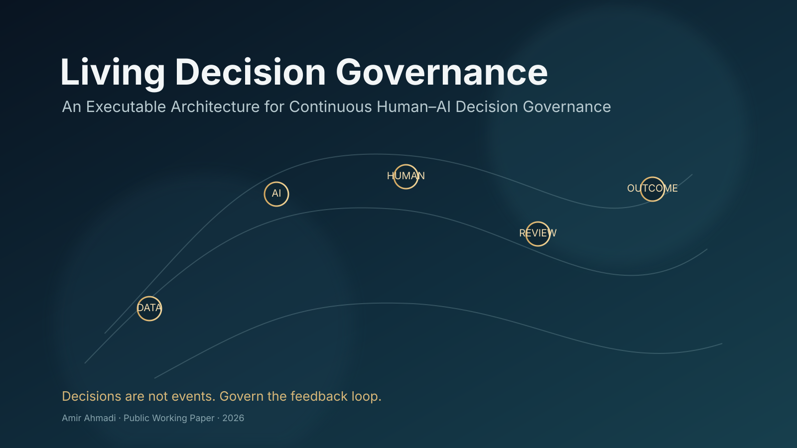
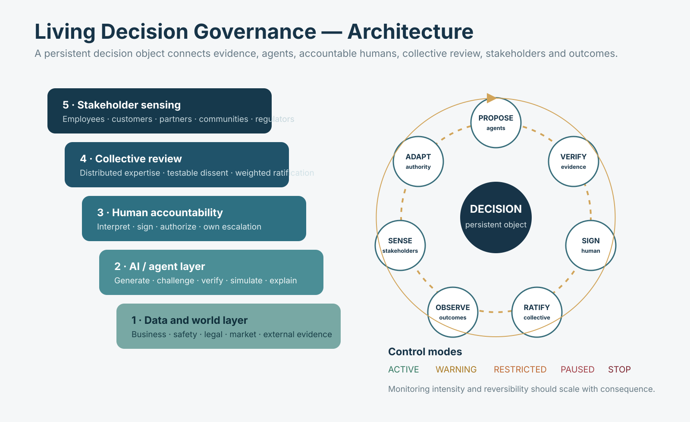

# Living Decision Governance (LDG)



**Status:** Public Working Paper / Executable Research Artifact v0.2.0-draft  
**Author:** Amir Ahmadi  
**Affiliation:** Independent Researcher  
**Year:** 2026

## Start here

For the complete project in one document — origin, theory, architecture, examples, related work, executable model, falsification criteria and research roadmap — read:

### **[LDG_COMPLETE.md](LDG_COMPLETE.md)**

The modular files below remain useful for implementation, testing, citation and machine review.

## Working thesis

Living Decision Governance treats consequential human–AI decisions as governed, continuously monitored objects rather than one-time approvals.

```text
Propose → Challenge → Verify → Human Sign → Collective Ratification
→ Execute → Observe → Stakeholder Feedback → Re-score
→ Adapt Authority → Continue / Slow / Restrict / Pause / Stop → Learn
```



## Intellectual origin

The inquiry was triggered by a public observation from **Christopher J. Skinner** about a blind spot in enterprise AI: systems can increasingly represent transactions, documents, workflows and code while still struggling to represent human thinking, communication, decision quality and leadership.

LDG uses that observation as a starting question, not as evidence for the framework and not as a claim of co-authorship:

> What if the missing layer is not only better representation of the decision-maker, but continuous governance of the decision itself after it enters the world?

The project then develops an independent architecture around persistent decision objects, AI-agent challenge and verification, accountable human signatures, distributed review, stakeholder sensing, adaptive authority, and explicit warning/slowdown/pause/stop mechanisms.

## Repository contents

- `LDG_COMPLETE.md` — single comprehensive master document
- `paper.en.md` — English working paper
- `specification.md` — executable conceptual specification
- `assets/ldg-cover.svg` — project cover
- `assets/ldg-architecture.svg` — architecture diagram
- `src/ldg.py` — minimal v0.1 reference simulation
- `src/ldg_v02.py` — richer v0.2 executable reference model
- `examples/customer_support_demo.py` — understandable end-to-end example
- `tests/test_ldg.py` — original behavior tests
- `tests/test_ldg_v02.py` — v0.2 behavior and safety tests
- `machine-readable/verification-protocol.json` — machine-readable claims and checks
- `machine-readable/AI-README.md` — AI-assisted adversarial review guidance
- `website/index.html` — standalone landing page
- `CITATION.cff` — citation metadata

## Run the model

From the repository root:

```bash
python papers/2026-living-decision-governance/src/ldg_v02.py
```

Run the concrete scenario:

```bash
python papers/2026-living-decision-governance/examples/customer_support_demo.py
```

Run tests:

```bash
python -m pip install pytest
pytest -q papers/2026-living-decision-governance/tests
```

A GitHub Actions workflow (`.github/workflows/ldg-tests.yml`) automatically runs the tests and demo when LDG files change.

## Related research

LDG is intentionally positioned beside — not retroactively derived from — adjacent work on AI risk management, algorithmic decision support, participatory AI, collective intelligence, decentralized governance and contestability.

The comprehensive document discusses:

- NIST AI RMF
- ISO/IEC 42001
- Meyer (2024), *Doing AI*
- Zhang et al. (2023), *Deliberating with AI*
- De Liddo et al. (2026), Human/AI Collective Intelligence
- Han et al. (2025), DAO-AI
- Moreira et al. (2025), AI contestability

See **[LDG_COMPLETE.md §13](LDG_COMPLETE.md#13-adjacent-research-related-not-claimed-as-inspiration)**.

## Scope and integrity

LDG is a conceptual and executable research artifact. It is **not** presented as a validated governance standard or production safety system.

The project distinguishes:

- an intellectual trigger,
- adjacent prior work,
- the author's working contribution,
- executable behavior,
- and empirical evidence.

No formal novelty or real-world safety claim should be made until deeper prior-art review and empirical evaluation are completed.

## Core design principles

1. Decisions remain governable after deployment.
2. AI can recommend; accountable organizations authorize.
3. High-impact decisions should not be fire-and-forget.
4. Dissent should be preserved and consequential blocking should be testable.
5. Authority can expand, contract, pause or terminate according to evidence.
6. Stakeholder harm can invalidate apparent business success.
7. Monitoring intensity should scale with consequence and reversibility.
8. Stop mechanisms are governance primitives, not failures of innovation.
9. Criticism can be useful signal even without a proposed solution.
10. The goal is to discover where a decision process degraded, not merely who lost.

## License

Unless superseded by a repository-level license, text is intended for CC BY 4.0 publication. Code is a research reference implementation and must be reviewed before production reuse.
